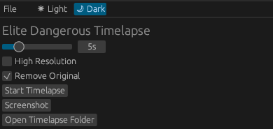

# ED Timelapse

ED-Timelapse is a tool to help capturing timelapses in the video game Elite Dangerous.

It works by triggering an in-game screenshot, and then moves it in a folder dependent on the current
date and the player's location in game. The file is also compressed.

## Aknowledgment

ED-Timelapse is made possible thanks to:

- [rust](https://www.rust-lang.org)
- [egui](https://egui.rs)
- [ed-journals](https://github.com/rster2002/ed-journals)

## Limitations

Many

## Motivations

N/A
